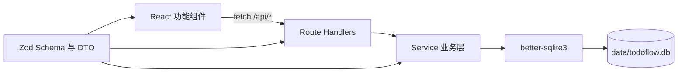

# TodoFlow 架构说明

## 1. 总体结构

TodoFlow 是单个 Next.js 应用，但在代码层保持前后端分离：



采用同域单进程的原因：

- 本地部署简单。
- REST 边界清晰，未来可拆分独立前端或后端。
- 不引入 CORS、服务发现和额外进程管理。

## 2. 目录职责

### `src/app`

- App Router 页面入口。
- `/api` 下是 REST Route Handlers。
- Route Handler 使用 `ok`、`noContent` 和 `fail` 生成统一响应。
- 根路径 `/` 重定向到 `/todos`。

Route Handler 不应包含 SQL 或复杂业务判断。

### `src/features`

- 按 Todo、模板、执行划分前端功能。
- 使用 Client Components 和原生 `fetch`。
- 成功写入后重新获取服务端数据，服务端是唯一事实来源。
- 不直接使用数据库模型。

### `src/server`

- `db.ts`：打开 SQLite、设置 WAL 和外键、初始化及兼容升级表结构。
- `errors.ts`：业务错误与未知错误转换。
- `http.ts`：REST 响应帮助函数。
- `services/`：事务、查询、状态聚合和业务约束。

### `src/shared`

- `schemas/`：前后端共享 Zod 输入规则。
- `types/`：REST DTO，不等同于数据库行类型。
- `api-client.ts`：前端统一请求及错误处理。
- `run-status.ts`：无副作用的状态计算函数。

### `tests`

- `services.test.ts`：数据库与核心业务集成测试。
- `run-status.test.ts`：执行状态纯函数测试。
- 测试使用 `data-test/` 下的临时 SQLite 文件。

## 3. 数据库策略

实际运行时使用 `better-sqlite3`。

启动流程：

1. 从 `DATABASE_URL` 解析数据库路径。
2. 自动创建父目录。
3. 开启 WAL 和外键。
4. 执行 `CREATE TABLE IF NOT EXISTS`。
5. 使用 `ensureColumn` 补充旧数据库缺失字段。
6. 执行必要的数据回填。

`prisma/schema.prisma` 用于快速阅读模型关系，不参与运行或迁移。修改数据库时，
`src/server/db.ts` 才是实际来源。

数据库表：

| 表 | 用途 |
|---|---|
| `Todo` | Todo 基础信息、完成状态与富备注 |
| `SopTemplate` | SOP 模板 |
| `SopTemplateNode` | 模板节点及父子关系 |
| `SopRun` | 独立标题、可选版本号的执行实例和模板快照 |
| `SopRunNode` | 执行节点快照、状态、备注和时间 |
| `NoteImage` | 富备注图片元数据 |

`SopRun.archivedAt` 用于区分未归档与已归档执行；删除 `SopRun` 时数据库外键会级联
删除对应 `SopRunNode`。

富备注 HTML 正文和图片 ID 保存在业务表 JSON 字段中，图片文件位于
`data/note-images/`，`NoteImage` 保存 MIME 类型、扩展名和大小。服务层使用 HTML
白名单清洗正文，所有备注 UI 复用 `RichNoteEditor`。

## 4. 数据流

### Todo 更新

```text
TodoPage
→ PATCH /api/todos/:id
→ todoService.update
→ SQLite
→ 重新 GET 列表
```

### 创建 SOP 执行

```text
POST /api/runs
→ 校验模板并规范化可选版本号
→ 同一事务创建 SopRun
→ 复制全部模板节点并重映射 parentId
→ 返回独立快照
```

模板后续修改不会影响已经创建的执行实例。

### 更新执行节点

```text
PATCH 节点状态
→ 验证节点是叶子节点
→ 更新时间字段
→ 自动重算父节点
→ 自动重算执行状态
→ 返回完整执行 DTO
```

## 5. 前端结构

- 左侧导航：Todo、SOP 模板、SOP 执行。
- SOP 执行首页先以网格展示模板，进入模板后按未归档与已归档展示执行记录。
- 760px 以下切换为顶部导航。
- 视觉变量和主要组件样式位于 `globals.css`。
- 通用弹窗使用 `Modal`。
- 父 SOP 节点整行负责展开，左侧完成按钮为禁用灰色。
- 子节点按父节点折叠展示。

## 6. 扩展建议

适合继续保持当前结构的功能：

- Todo 搜索与筛选。
- 模板复制。
- 简单导出和备份。

只有出现以下需求才考虑拆分独立后端：

- 多用户身份认证。
- 局域网或公网服务。
- 第三方客户端调用。
- 后台任务或消息通知。
